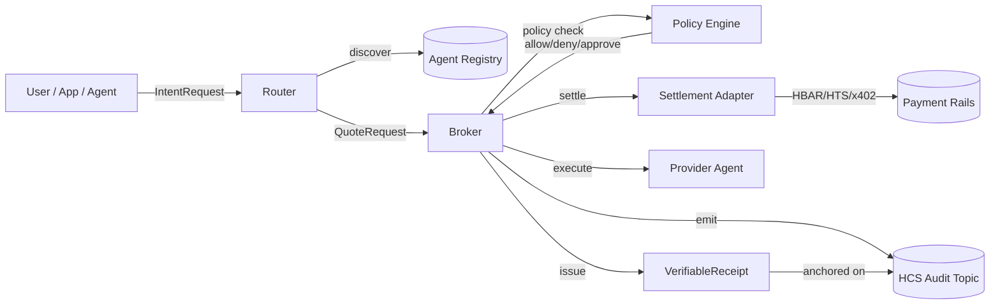

# Hedron

> **Hedron is a Hedera-native agentic commerce SDK and Router/Broker runtime for autonomous agents.** It lets agents and apps discover capabilities, request quotes, enforce policy, settle payments, execute workflows, and produce verifiable HCS-backed receipts.

[](https://github.com/Glorian-Labs/Hedron/actions/workflows/ci.yml)
[](https://www.typescriptlang.org/)
[](https://hedera.com)
[](https://opensource.org/licenses/ISC)

---

## Origins

Hedron began as a Glorian Labs project exploring autonomous-agent coordination on Hedera. It was recognized with **3rd place in the AI & DePIN track at the Hedera Africa Hackathon** (a **$30,000 prize**), alongside 1,300+ submissions and 13,000+ participants.

- DoraHacks winners page: <https://dorahacks.io/hackathon/hederahackafrica/winner>
- The Hashgraph Association announcement: <https://www.hashgraph.swiss/news-all/2025-hedera-africa-hackathon-announces-winners-officially-becomes-the-largest-web3-hackathon-globally>

The v0.2 branch is a deliberate productionization pass: it keeps the protocol foundations (A2A, AP2, HCS-10, x402) and rebuilds the runtime around an explicit Router/Broker contract with HCS-anchored receipts. Hackathon-era materials are preserved in private project notes outside the public repo.

---

## Status

Hedron is **v0.2 in progress**. This branch is the working refactor toward a production-grade Router/Broker runtime.

- **Testnet-first.** Hedron is currently focused on Hedera testnet; mainnet readiness is gated on a separate verification pass and is not implied by this branch.
- **Public APIs may change** until `v0.2.0` is tagged.
- **Smart contracts are unaudited and experimental.** Do not use against mainnet value without your own review.
- **Production hosting is a roadmap item**, not a current claim.
- **Receipts and HCS audit trails are the source of truth.** The repo intentionally does not "log success" without verifiable proofs.

For the milestones that follow this cleanup, see [`docs/ROADMAP.md`](docs/ROADMAP.md).

---

## What Hedron is

Hedron is the **commerce and proof layer** for agents on Hedera. Two surfaces:

1. **A Router/Broker runtime** that coordinates the canonical agent commerce loop:

   `discover agent → request quote → approve/pay → execute → log/attest → verify receipt`

2. **A TypeScript SDK** that lets external agent runtimes (Daydreams, Hedera Agent Kit v4 plugins, custom A2A/MCP agents) and applications participate in that loop with a small, deterministic surface.

Hedron makes the **proof** first-class: every step produces a structured HCS event, every flow ends with a verifiable receipt that anchors the result hash, payment id, policy decision hash, and HCS sequence range.

## Why Hedera

- **HCS** gives ordered, low-cost, queryable audit trails. Hedron commerce events live on a dedicated HCS topic, not in app logs.
- **HBAR / HTS** settlement is fast and deterministic — receipts are usable as the source of truth instead of an off-chain database.
- **x402 on Hedera** (exact payment scheme) lets HTTP-native agent calls pay per request with HBAR or HTS tokens directly, without a separate billing stack.
- **Hedera Agent Kit v4** ships first-class policies/hooks and modular plugins — Hedron exposes its commerce actions as a plugin so HAK agents inherit the policy surface for free.

## Architecture (high level)



For the detailed component breakdown see [`docs/ARCHITECTURE.md`](docs/ARCHITECTURE.md).
For the canonical event schema see [`docs/HCS_RECEIPTS.md`](docs/HCS_RECEIPTS.md).
For the Router/Broker contract see [`docs/ROUTER_BROKER.md`](docs/ROUTER_BROKER.md).

## Quickstart

> Requires Node 20+ and npm 10+.

```bash
git clone https://github.com/Glorian-Labs/Hedron.git
cd Hedron
npm install
cp .env.example .env   # placeholders are enough for the mocked demo
```

### Mocked local demo (no credentials needed)

```bash
npm run demo:local
```

Walks through the full discover → quote → approve → pay → execute → receipt loop against in-memory mocks. The receipt verifier runs at the end and prints the verification path.

### Optional Hedera testnet demo

You need a testnet account from <https://portal.hedera.com> and your operator key in `.env`.

```bash
# in .env
HEDERA_NETWORK=testnet
HEDERA_OPERATOR_ID=0.0.xxxxx
HEDERA_OPERATOR_KEY=<your-testnet-operator-private-key>
RUN_HEDERA_INTEGRATION=true

npm run demo:testnet
```

The testnet demo writes real HCS audit events to a topic Hedron auto-provisions on first run.

## Repository layout

```
.
├── .env.example               # Canonical environment template (placeholders only)
├── README.md
├── SECURITY.md
├── CONTRIBUTING.md
├── CHANGELOG.md
├── RELEASE_CHECKLIST.md
├── contracts/                 # Solidity, experimental, unaudited
├── deployments/testnet/       # Public testnet contract ids only
├── demo/
│   ├── local.ts               # canonical mocked end-to-end flow
│   └── testnet.ts             # opt-in real Hedera testnet flow
├── docs/
│   ├── INDEX.md · ARCHITECTURE.md · ROUTER_BROKER.md
│   ├── HCS_RECEIPTS.md · POLICY_ENGINE.md · SECURITY_MODEL.md
│   ├── QUICKSTART.md · ROADMAP.md
│   ├── DAYDREAMS_ADAPTER.md · X402_ADAPTER.md · HEDERA_AGENT_KIT_PLUGIN.md
│   └── DEPENDENCY_HARDENING.md
├── tests/unit/                # vitest, mock-only, 27 tests
└── src/
    ├── router/                # discovery, capability index, quote dispatch
    ├── broker/                # intent → quote → policy → settle → execute → receipt
    ├── registry/              # AgentIdentity / AgentCard / capability registry
    ├── policy/                # rules, context, decision, auditable events
    ├── settlement/            # hedera/, x402/, evm/
    ├── receipts/              # Receipt + VerifiableReceipt + verifier
    ├── hcs/                   # topic management, signed event envelopes
    ├── adapters/              # daydreams/, hedera-agent-kit/, mcp/
    ├── types/                 # shared, type-only public surface
    ├── errors/                # typed errors
    └── utils/
```

## Security warnings

- **Never commit `.env`.** Only `.env.example` (placeholders) is tracked.
- **Receipts > logs.** A flow without a `RECEIPT_ISSUED` event on HCS did not succeed, regardless of what the app says.
- **Default deny.** The policy engine denies unless an explicit rule allows. High-value actions require approval.
- **Replay protection is mandatory** for any payment integration. See [`docs/SECURITY_MODEL.md`](docs/SECURITY_MODEL.md) for the threat model.
- **Smart contracts are unaudited.** They are reference implementations of the supply-chain example agent, not production money paths.

## Adapters and integrations

Hedron is built so other agent runtimes plug in without forking:

| Adapter | Status | Doc |
| --- | --- | --- |
| Daydreams runtime | interface defined, skeleton in `src/adapters/daydreams/` | [`docs/DAYDREAMS_ADAPTER.md`](docs/DAYDREAMS_ADAPTER.md) |
| Hedera Agent Kit v4 plugin | interface defined, skeleton in `src/adapters/hedera-agent-kit/` | [`docs/HEDERA_AGENT_KIT_PLUGIN.md`](docs/HEDERA_AGENT_KIT_PLUGIN.md) |
| MCP server | planned (v0.3) | — |
| x402 facilitator (Hedera exact scheme) | adapter interface in `src/settlement/x402/` | [`docs/X402_ADAPTER.md`](docs/X402_ADAPTER.md) |
| Hedera HBAR / HTS native | primary rail | [`docs/ROUTER_BROKER.md`](docs/ROUTER_BROKER.md) |

## Roadmap

See [`docs/ROADMAP.md`](docs/ROADMAP.md) for versioned milestones (v0.2.0-alpha → v0.5+).

## Contributing

See [`CONTRIBUTING.md`](CONTRIBUTING.md). Small reviewable PRs preferred. Adapter contributions must include a manifest, an interface conformance test, and a mock-mode end-to-end test.

## License

ISC — see [`LICENSE`](LICENSE).

---

Built by **[Glorian Labs](https://github.com/Glorian-Labs)** — agentic intelligence for the next economy.

**Hedron** — verifiable commerce for autonomous agents on Hedera.
